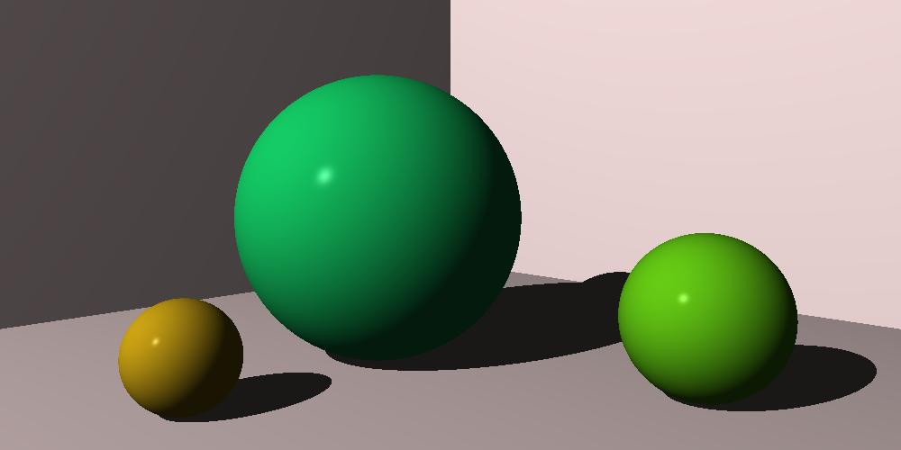

# Rust Ray Tracer

<!-- toc -->

- [Project structure](#project-structure)
- [Testing](#testing)
- [Building the binaries](#building-the-binaries)
- [TODO](#todo)
- [Renderings](#renderings)
  * [Spheres with shadows](#spheres-with-shadows)

<!-- tocstop -->

This repository contains rust code for the book "Ray Tracer Challenge by Jamis Buck".

It is not meant to be an optimised version of the ray tracer. I followed this book to learn the Rust programming language. I have made sure to replicate the various logic and tests presented throughout the book. I may be wrong in some cases and not follow idiomatic code, but, I will try to keep the code well documented and easy to read.

## Project structure

- src/ : contains the code for various data types like tuple, vector, projectile etc and unit tests.
  - bin/ : contains end of the chapter exercises

## Testing

All the unit tests are present in the each of the source code files. You can run all the tests using the command-

```bash
cargo test
```

## Building the binaries

You have to build each binary in the src/bin directory separately.

```bash
cargo run --bin <binary file name without extension>
```

## TODO

- [ ] Use modules to organise the code
- [ ] Use borrowing instead of creating copies to make code efficient
- [ ] Optimise the matrix class
- [ ] Reduce unnecessary dependencies between structs and move out ray tracing related functions

## Renderings
### Spheres with shadows


